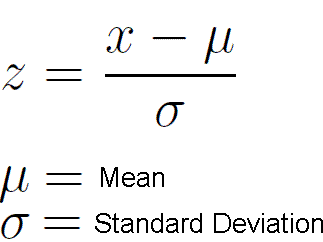
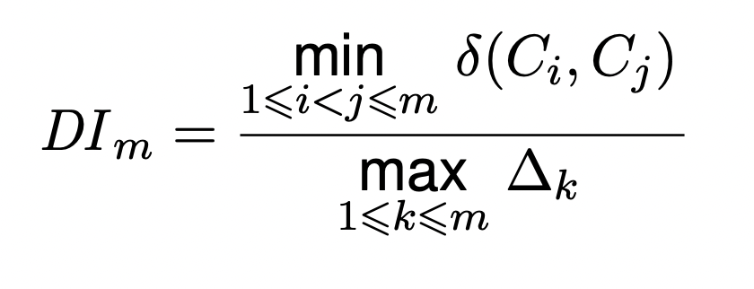
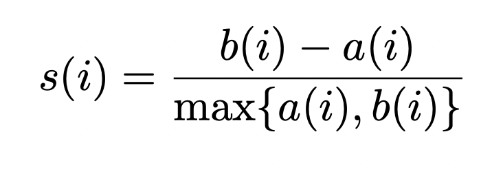
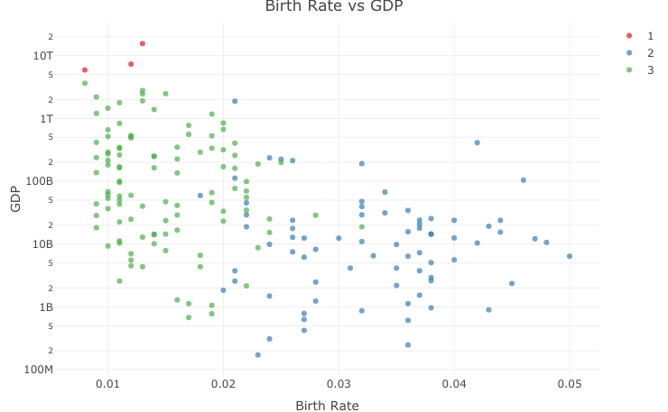
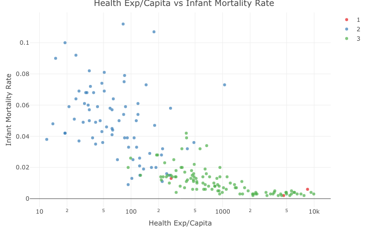
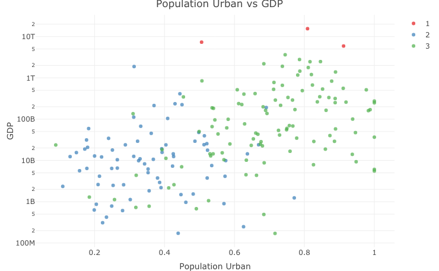

## Objective 

The world indicators dataset compares different countries based on selected attributes.
1. To use K-means and hierarchical clustering methods to group similar countries together
2. To use Internal validation metrics such as Silhouette co-efficient to report the cluster quality
3. Tune the hyperparameters to report the best clustering solution. 
4. To give a detailed list of all the groups and the countries included within each group
5. To generate few plots that would explain the characteristics of each cluster


```{r setup, include=FALSE}
library(readr)
library(dplyr)
library(ggplot2)
library(plotly)
library(factoextra)
library(tidyr)
library(scales)
library(corrplot)
library(ClusterR)
library(clValid)

set.seed(22)
```

##### Reading the dataset
```{r echo=TRUE, message=FALSE, eval=TRUE}
df <- read_csv("World Indicators.csv")
```

##### Reading the structure of the dataset
```{r echo=TRUE, eval=TRUE}
str(df)
```

##### Checking for NA values
```{r echo=TRUE, eval=TRUE}
sort(colSums(is.na(df)))
```
Energy Usage and Lending Interest columns have around 35% of NA values. Mostly we will be dropping these columns during our analysis

##### Converting GDP and Health Exp % GDP to numeric form
```{r echo=TRUE, eval=TRUE}
df$GDP <- parse_number(df$GDP)
df$`Health Exp/Capita` <- parse_number(df$`Health Exp/Capita`)
df$`Business Tax Rate` <- parse_number(df$`Business Tax Rate`)
```

##### Analyzing the correlation between various features
```{r echo=TRUE, eval=TRUE}
df_num <- as.data.frame(select_if(df, is.numeric))
corval <- cor(df_num, use="na.or.complete")
corrplot(corval, type="upper")
```

In the correlation plot above, it can be observed that few columns correlate well with the other columns. This means that few columns (or features) are redundant and can be dropped from the dataframe. Columns such as Birth Rate, Infant Mortality Rate, Internet Usage, Life Expectancy Female, Life Expectancy Male, Population 0-14, Population 15-64 correlate highly with each other. Another such group is Energy Usage and GDP as well as GDP, Health Exp % GDP, Health Exp/Capita. Instead of dropping all of these columns, we have to retain one column to represent these groups. For the last two groups, it is easy to determine the set of columns that we have to retain; we are going to retain GDP from both the groups. However, for the first group, it is difficult to externally determine the representing column. We will retain the column that has the highest correlation value with all other columns. To find out which column has the highest correlation, let's use the "corval" matrix.

##### Determining the column with the highest correlation value among the above listed columns
```{r echo=TRUE, eval=TRUE}
colvec <- c("Birth Rate", "Infant Mortality Rate", "Internet Usage", "Life Expectancy Female",
           "Life Expectancy Male", "Population 0-14", "Population 15-64")
cval1 <- corval[colvec, colvec]
sort(colMeans(abs(cval1)), decreasing = TRUE)[1]
```

It can be concluded that Birth Rate is the column that we want to retain among these 7 columns.

##### Dropping the other 9 columns
```{r echo=TRUE, eval=TRUE}
colvec2 <- c("Infant Mortality Rate", "Internet Usage", "Life Expectancy Female",
           "Life Expectancy Male", "Population 0-14", "Population 15-64", "Energy Usage", 
           "Health Exp % GDP", "Health Exp/Capita")

df2 <- df[, !(names(df) %in% colvec2)]
df_num <- df_num[, !(names(df_num) %in% colvec2)]
```


##### Check NA values
```{r echo=TRUE, eval=TRUE}
sort(colSums(is.na(df2)), decreasing=TRUE)
```

##### Lets go ahead and drop the columns which has more than 10% (>20 NA values) data missing. We are doing so because if we replace these values with either mean or median or zero; then we will introduce bias and these records with replaced values will have similar features and eventually form a cluster, which we would want to avoid. For the remaining features, let's replace the NA values with the mean in the numerical columns.
```{r echo=TRUE, eval=TRUE}

coldrop <- c("Lending Interest", "Hours to do Tax", "Business Tax Rate", "Days to Start Business")
df2 <- df2[, !names(df2) %in% coldrop]
df_num <- df_num[, !names(df_num) %in% coldrop]

colmean <- as.list(colMeans(df_num, na.rm=TRUE))
df_num <- replace_na(df_num, colmean)

df2 <- replace_na(df2, colmean)
```

We have the final set of 5 columns (or features) that we are going to perform clustering.
##### Let us feature scale each of the columns to obtain best clustering result. But before that, let us boxplot each of these features quickly to see if there are any outliers
```{r echo=TRUE, eval=TRUE}
for (i in (1:5)) {
  boxplot(df2[i], xlab=names(df2[i]))
}
```

##### There are many outliers especially for the column GDP. Hence, we will have to scale the values using Standard Scaler function defined by --



```{r echo=TRUE, eval=TRUE}
df2[1:5] <- scale(df2[1:5], center=TRUE, scale=TRUE)
```

Now we are ready for clustering. However, we need to find the optimal number of clusters first. 
##### Let us implement Elbow method and Silhouette method to get the number of clusters.
```{r echo=TRUE, eval=TRUE}
#kmeans(df2[1:5], )
fviz_nbclust(df2[1:5], FUNcluster = kmeans, method = "wss")
fviz_nbclust(df2[1:5], FUNcluster = kmeans, method = "silhouette")
```

Both Elbow method (WSS) and Silhouette method suggests that 2 is the optimal number of clusters.

##### However, let's perform kmeans clustering with centers from 2 to 10 in a loop and analyze each. We will use Dunn Index and Silhouette Co-efficient as two internal analysis metrics to evaluate.





```{r echo=TRUE, eval=TRUE}
centersloop=2:10
dunns <- list()
sse <- list()
ssb <- list()
s1 <- list()
d1 <- dist(df2[1:5], method = "euclidean")
for (centers in centersloop) {
  k1 <- kmeans(df2[1:5], centers = centers, iter.max=100000, nstart=200)
  sse <- append(sse, k1$tot.withinss) #Sum of Squared Errors within cluster
  ssb <- append(ssb, k1$totss)        #Group Sum of Squares 
  dunns <- append(dunns, dunn(clusters=k1$cluster, Data=df2[1:5]))  #Dunn index
  s1 <- append(s1, summary(silhouette(k1$cluster, d1))$avg.width)   #Silhouette Average Width
}

```

##### Implementing Hierarchical Clustering
```{r echo=TRUE, eval=TRUE}
clusters <- 2:10
d1 <- dist(df2[1:5], method = "euclidean")
hc1 <- hclust(d1, method = "complete")

dunns2 <- list()
s2 <- list()

plot(hc1, cex = 0.6, hang = -1)

for (c in clusters) {
  hclust1 <- cutree(hc1, k = c)
  dunns2 <- append(dunns2, dunn(clusters=hclust1, Data=df2[1:5]))  #Dunn index
  s2 <- append(s2, summary(silhouette(hclust1, d1))$avg.width)   #Silhouette Average Width
}
```


##### Comparing the Silhouette scores of K means and Hierarchical clustering to choose the optimal number of clusters and the algorithm
```{r echo=TRUE, eval=TRUE}

plot(x=2:10, y=s1, type="b", xlab="Number of Clusters", ylab="Silhouette co-efficient of K means")
plot(x=2:10, y=s2, type="b", xlab="Number of Clusters", 
     ylab="Silhouette co-efficient of Hierarchical clustering")
#Hierarchical clustering with 2 centers gives erroneous results and we are ignoring it deliberately
```

The above plots indicate that we can get the best clustering solution by implementing kmeans with center equals 3. 
##### Implementing K means with 3 centers.
```{r echo=TRUE, eval=TRUE}
k1 <- kmeans(df2[1:5], centers = 3, iter.max=100000, nstart=20)
print("Number of countries in each cluster")
print(table(k1$cluster))

c1 <- subset(df, k1$cluster == 1)
c2 <- subset(df, k1$cluster == 2)
c3 <- subset(df, k1$cluster == 3)

print("Countries in the First Cluster")
print(c1[, c("Country", "Region", "GDP", "Life Expectancy Female", "Birth Rate")])

print("Countries in the Second Cluster")
print(c2[, c("Country", "Region", "GDP", "Life Expectancy Female", "Birth Rate")])

print("Countries in the Third Cluster")
print(c3[, c("Country", "Region", "GDP", "Life Expectancy Female", "Birth Rate")])

```

##### Lets understand the details of these 3 clusters by plotting a heatmap of the centers of these clusters.
```{r echo=TRUE, eval=TRUE}
print(k1$centers)
heatmap(k1$centers, Rowv=NULL, Colv=NULL, xlab="Features", ylab="Clusters")
```

The above heatmap can give a gist of the characteristics of each of the cluster created by the algorithm

##### Scatter plot between Birth Rate and GDP and the clusters
```{r echo=TRUE, eval=TRUE}
df$Clusters <- k1$cluster

fig1 <- plot_ly(data = df, 
          x=df$`Birth Rate`, y=df$GDP, 
          type="scatter", mode="markers", 
          color = as.factor(df$Clusters),
          colors = "Set1",
          alpha = 0.7,
          text = ~Country,
          hovertemplate= '<b>%{text}</b>'
          )
fig1 <- fig1 %>%
  layout(title = "Birth Rate vs GDP",
      xaxis = list(title = 'Birth Rate'),
      yaxis = list(title = 'GDP', type="log")
    )

fig1


# ggplot(df, aes(x=df$`Birth Rate`, y=GDP, color=as.factor(Clusters)))+
#   geom_point()+
#   scale_y_continuous(trans="log", labels=dollar)+
#   labs(x="Birth Rate", y="GDP", color="Clusters", title="Birth Rate vs GDP")
  #theme(legend.title = "Clusters")
```


Here, it can be observed that Birth Rate and GDP are inversely related. And the clusters divided can be observed to be as - (The order might differ with each successive runs)
1. Lower GDP and Higher Birth Rate
2. Higher GDP and Lower Birth Rate 
3. Medium GDP and Medium Birth Rate

##### Scatter plot between Health Exp/Capita vs Infant Mortality Rate abd the clusters
```{r echo=TRUE, eval=TRUE}

fig1 <- plot_ly(data = df, 
          x=df$`Health Exp/Capita`, y=df$`Infant Mortality Rate`, 
          type="scatter", mode="markers", 
          color = as.factor(df$Clusters),
          colors = "Set1",
          alpha = 0.7,
          text = ~Country,
          hovertemplate= '<b>%{text}</b>'
          )
fig1 <- fig1 %>%
  layout(title = "Health Exp/Capita vs Infant Mortality Rate",
      xaxis = list(type="log", title = 'Health Exp/Capita'),
      yaxis = list(title = 'Infant Mortality Rate')
    )

fig1

# ggplot(df, aes(x=df$`Health Exp/Capita`, y=df$`Infant Mortality Rate`, color=as.factor(Clusters)))+
#   geom_point()+
#   scale_x_continuous(trans="log", labels=dollar)+
#   labs(x="Health Exp/Capita", y="Infant Mortality Rate", color="Clusters")
#   #theme(legend.title = "Clusters")
```



As one would expect, Infant mortality rate and Health Expenditure Per capita is inversely proportional and again we observe 3 clusters - 
1. High IMR and Low Health Expenditure per capita
2. Moderate IMR and Moderate Health Expenditure per capita
3. Low IMR and High Health Expenditure per capita

##### Scatter plot between Population Urban vs GDP and the clusters
```{r echo=TRUE, eval=TRUE}
#df$Clusters <- k1$cluster

fig1 <- plot_ly(data = df, 
          x=df$`Population Urban`, y=df$GDP, 
          type="scatter", mode="markers", 
          color = as.factor(df$Clusters),
          colors = "Set1",
          alpha = 0.7,
          text = ~Country,
          hovertemplate= '<b>%{text}</b>'
          )
fig1 <- fig1 %>%
  layout(title = "Population Urban vs GDP",
      xaxis = list(title = 'Population Urban'),
      yaxis = list(type="log", title = 'GDP')
    )

fig1

# ggplot(df, aes(x=df$`Population Urban`, y=GDP, color=as.factor(Clusters)))+
#   geom_point()+
#   scale_y_continuous(trans="log", labels=dollar)+
#   labs(x="Population Urban", y="GDP", color="Clusters")
#   #theme(legend.title = "Clusters")
```


A positive trend can be observed between population living in the urban and GDP. The clusters divided can be observed as - 
1. Lower population in the urban and Lower GDP
2. Higher population in the urban and Higher GDP
3. Scattered cluster


#### Conclusion 
The clusters divided make sense even in the real world where the top performing countries like USA, China, Japan are in one cluster and then the moderate performing (majority of the European countries) and the poorly performing countries (majority of African countries). As the dataset contains the features that are mostly related to economy and healthy lifestyle, we get these clusters from the algorithm. If we wish to see these based on other factors (natural resources availability, human resources etc.), then we should add more features.  
